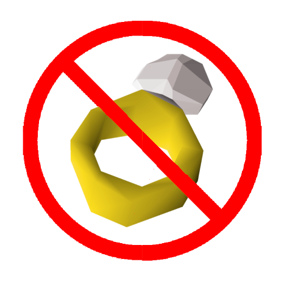

A simple [RuneLite](https://runelite.net/) plugin to remind [OSRS](https://oldschool.runescape.com/) Hardcore Ironmen to equip their Ring of Life if they don't have it equipped.

---

Credit to the plugin that inspired this: [protect-item-notify](https://github.com/mathewchapman/protect-item-notify/tree/master) by [Mathew Chapman](https://github.com/mathewchapman)
